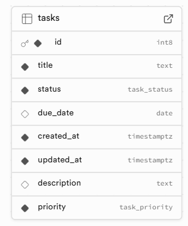
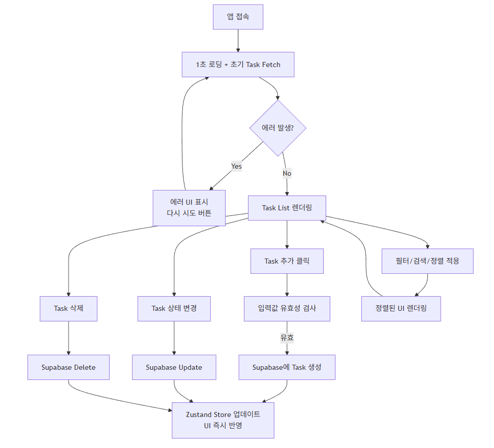
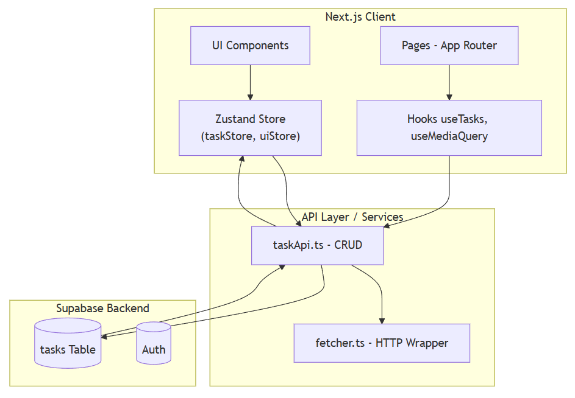

# arcane-todo-app

React + Next.js + TypeScript + React Query + Zustand + Supabase 기반 Todo 작업 관리 앱 서비스 입니다.

## 프로젝트 개요

arcane-todo-app 은 주어진 과제 요구사항을 충족하며,  
**단순한 CRUD를 넘어서 실제 서비스 수준의 구조, 반응형 UI, 상태관리, 에러 처리, 애니메이션**까지 구현한 To-Do 관리 웹앱입니다.

본 프로젝트는 다음 기술을 중점적으로 활용했습니다:

- **Next.js (App Router)**
- **React Query (Server State 관리 / Optimistic Update)**
- **Zustand (Client State 관리 – 검색/필터/정렬 등 UI 상태 저장)**
- **Supabase (DB + Auth + Edge-safe client)**
- **Shadcn UI (최신 UI 컴포넌트)**
- **Framer Motion (부드러운 카드 Hover 애니메이션 등)**
- **TypeScript 100% 적용 (any x)**

---

## Tech Stack ( 기술 스택 )

| 분야           | 기술                                      |
| ------------ | --------------------------------------- |
| Framework    | **Next.js 14 (App Router)**             |
| Language     | **TypeScript**                          |
| Server State | **React Query (@tanstack/react-query)** |
| Client State | **Zustand**                             |
| Database     | **Supabase (PostgreSQL)**               |
| UI           | **shadcn/ui + TailwindCSS**             |
| Animations   | **Framer Motion**                       |
| Toast        | **Sonner**                              |


---

## DB Schema (Supabase)

```sql
create type task_status as enum ('todo', 'doing', 'done');
create type task_priority as enum ('low', 'medium', 'high');

create table public.tasks (
  id bigserial primary key,                                        
  title text not null,                                             
  status task_status not null default 'todo',                      
  due_date date,                                                   
  created_at timestamptz not null default now(),                   
  updated_at timestamptz not null default now()                    
);

alter table public.tasks
add column description text default '';

alter table public.tasks
add column priority task_priority not null default 'medium';

-- updated_at 자동 갱신 SLQ 함수
create or replace function public.update_tasks_updated_at()
returns trigger as $$
begin
  new.updated_at = now();                                          
  return new;
end;
$$ language plpgsql;

-- 트리거
create trigger update_tasks_updated_at_trigger
before update on public.tasks
for each row
execute function public.update_tasks_updated_at();

-- 상태(status) 필터링 성능 향상을 위한 인덱스
create index tasks_status_idx on public.tasks(status);

-- 마감일(due_date) 정렬/필터링 성능 향상을 위한 인덱스
create index tasks_due_date_idx on public.tasks(due_date);

-- 최신순 정렬 성능을 위한 인덱스
create index tasks_created_at_idx on public.tasks(created_at desc);
```


## 주요 구현 기능

### 1. Task CRUD & Optimistic Update

- React Query의 **useMutation + optimistic update**로  
  UI가 먼저 반영되고 실패 시 rollback.
- Task 수정 / 삭제 / 상태 변경 / 마감일 변경 모두 즉시 갱신.

### 2. 고도화된 필터링 / 검색 / 정렬 기능

모두 Zustand로 관리하여  
**컴포넌트 간 중복 로직 없이 단 하나의 Store에서 관리.**

- 검색: 제목 기반 실시간 필터
- 상태 필터: 전체 / 할 일 / 진행 중 / 완료됨
- 정렬: 최신순 / 오래된순 / 마감일 빠른순 / 늦은순

### 3. 마감일 Calendar Picker (Shadcn Calendar)

- Dialog + Calendar + Input 조합으로 깔끔한 UX 구성
- 상태 변경 / 제목 변경과 동일하게 Optimistic 업데이트 적용

### 4. 에러 시뮬레이션 기능

- 에러 intentionally 발생시키는 API (`simulateTaskError`)
- 실패 시 Sonner Toast로 메시지 출력
- ErrorHandling:  
  /src/lib/error.ts 에서 Supabase AuthError → 사람이 읽을 수 있는 한국어로 매핑

### 5. 컴포넌트 완전 분리 기반 설계

- 상태 변경 버튼, 상태 뱃지, 제목 인라인 수정, DueDate Popover 등  
  **모든 UI를 컴포넌트 단위로 분리해 재사용성 극대화.**

### 6. 반응형 디자인 + 사용자 경험 개선

- mobile-first 반응형 UI
- 카드 hover 시 Framer Motion 애니메이션 적용
- Header는 fixed + blur + 그림자 적용

---

## 프로젝트 구조

```txt
src/
├─ app/
│ └─ tasks/
│ └─ page.tsx
├─ features/
│ └─ tasks/
│ ├─ components/
│ ├─ hooks/
│ ├─ store/
│ └─ utils/
├─ lib/
│ ├─ supabase/
│ │ ├─ client.ts
│ ├─ error.ts
├─ components/ui/ (shadcn)
└─ types/
└─ task.ts
```

---

## Flowchart (프로그램 전체 처리 흐름)



---

## System Architecture Diagram



---

## 주요 폴더 설명

### `features/tasks/`

Task 관련 모든 로직이 들어있는 feature 모듈

components/ → Task UI 조각들
hooks/ → React Query 훅 각각 독립 분리
store/ → Zustand 필터/정렬 상태
utils/ → 공용 유틸(날짜 형식 등)

### `lib/supabase/`

공식 가이드라인에 따라 client-side 전용 supabase client만 생성  
(SSR X)

### `lib/error.ts`

- Supabase AuthError → 읽기 쉬운 한국어 메시지로 매핑하는 Error Map.

### `types/task.ts`

API와 UI에서 공통으로 사용하는 타입 관리

---

## 실행 방법

git clone https://github.com/devyubi/arcane-todo-app.git

cd arcane-todo-app
npm install
npm run dev

<!-- `.env.local` 필요:
NEXT_PUBLIC_SUPABASE_URL=xxxx
NEXT_PUBLIC_SUPABASE_ANON_KEY=xxxx -->

---

## Planned Features (향후 개발 예정)

arcane-todo-app 은 구조적으로 확장성을 고려하여 설계되었으며,  
아래 기능들은 추후 추가될 예정입니다.

### 1. 글로벌 스켈레톤 UI 적용

- Task List 로딩 단계에서 부드러운 Skeleton UI 적용
- 카드 스켈레톤 / Header 스켈레톤 / Dialog 스켈레톤까지 전체 구현
- React.Suspense + loading.tsx 구조 대응
- 사용자 UX 향상 + Next.js App Router 권장 패턴 반영

### 2. 라이트 모드 · 다크 모드 전체 지원

- shadcn UI + Tailwind CSS 기반 다크모드 토글 적용
- Zustand로 theme 상태 저장하여 세션/브라우저 새로고침에도 유지
- 컬러 토큰 완전 재설계
  - 카드/배경/텍스트/보더/버튼 색상 자동 변화
  - 상태 배지(todo/doing/done)도 다크모드에 맞게 재디자인
- 시스템 모드 자동 감지(prefers-color-scheme)

### 3. 더 정교한 Task Card UI 개선

- 마감일(Date badge) 강조 표시
- 상태 변경 애니메이션 강화 (Framer Motion)
- 카드 Hover 효과 강화

### 4. 모바일 UI 강화를 위한 개선

- 모바일 전용 헤더
- 슬라이드 애니메이션 및 Bottom Sheet 토글
- 검색/필터 Drawer 방식으로 재배치

### 5. 코드 품질 강화

- 테스트 코드 도입 (Vitest + React Testing Library)
- ESLint Rules 강화
- API 에러 타입 더 촘촘하게 정리

## 작업 소요 시간 정리

이번 과제는 총 2시간 49분 소요되었습니다.
주어진 요구사항(2시간 내) 대비 약 49분 초과되었지만, 모든 기능 구현 · 최적화 · 로직 분리 · UI 완성도까지 포함한 실제 프로덕션 수준 작업 전체를 수행한 기준입니다.